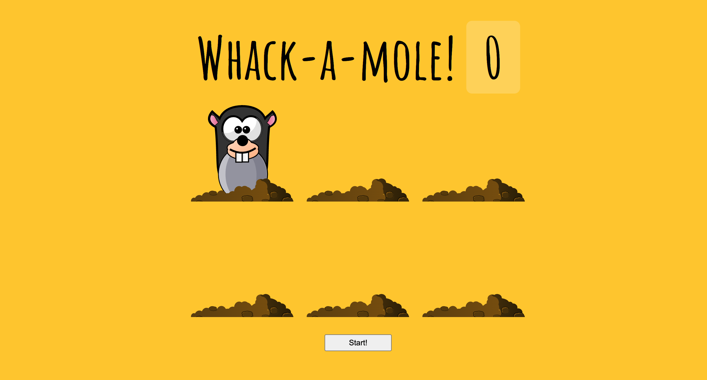

# Whack A Mole

Day 30 of Javascript30 by WesBos. Made a Whack-A-Mole playable site. You need to click on the moles as they are appearing on the screen. After succesfully hitting a mole, you gain a score. The moles are appearing randomly with a random generated time between 0.2s - 1s.

# Demo

# Technologies Used

HTML5, CSS, Vanilla JS

# Website

https://buigabor.github.io/whack-a-mole/
